# Projet FFA - Dashboard Fédération Française Athlétisme

## Somaire

- [User Guide](#user-guide)

- [Data](#data)
  - [Structure du projet](#structure-du-projet)
  - [Introduction](#introduction)
  - [Description des fichiers](#description-des-fichiers)
  - [Rapport d'analyse](#rapport-danalyse)
    - [Page d'accueil](#page-daccueil)
    - [Page coureur](#page-coureur)
    - [Page course](#page-course)
    - [Page map](#page-map)
    - [Page histogramme](#page-histogramme)
    - [Exemple d'utilisation du dashboard](#exemple-dutilisation-du-dashboard)

- [DevOps](#devops)
  - [Structure DevOps](#structure-devops)
  - [Fichiers DevOps](#fichiers-devops)
  - [Ouverture des instances AWS](#ouverture-des-instances-aws)
  - [Gestion des droits d’accès](#gestion-des-droits-dacces)
  - [Lancement de GitHub et Configuration CI/CD](#lancement-de-github-et-configuration-cicd)
  - [Installation des packages](#installation-des-packages)
  - [Importation des données dans Elasticsearch](#importation-des-donnees-dans-elasticsearch)
  - [Création du Cluster Kubernetes](#creation-du-cluster-kubernetes)
  - [Configuration et explication des fichiers Kubernetes](#configuration-et-explication-des-fichiers-kubernetes)
  - [Accès à l'application](#acces-a-lapplication)
  - [Conclusion](#conclusion)

---


#
# USER GUIDE

Ce projet combine deux projet en un. C'est d'abord un projet de devops ou je créée un serveur sur AWS pour éberger un application web. C'est aussi un projet de data avec plus de 1 000 000 de données qui sont rangé dans ce même serveur. Plusieurs façon de lancer le projet. En interne, sur une machine local. Après avoir installé MongoDb, ElasticSearch et docker/docker-compose, on peut lancer la commande docker-compose up --build, pour ainsi lancer le projet. Ensuite il suffit d'ouvrir son navigateur sur localhost:8060 pour voir le projet. On peut aussi lancer en externe, en ouvrant mon instance AWS (details du fonctionnement après), et en lanceant depuis un terminal connecté à ce serveur, mon application. Elle est alors connécté à "IP_Serveur:8060" accésible depuis toute connexion internet sans restriction (ça ne marche pas sur le wifi de l'Esiee par exemple).

#
# DATA


Nous avons choisis de scrapper le site de la FFA pour ce projet voici l'url : "https://bases.athle.fr/asp.net/liste.aspx?frmpostback=true&frmbase=calendrier&frmmode=1&frmespace=0"

Néanmoins, pour scrapper nos données nous avons utilisé cet url comme une base avant de faire une concaténation d'url avec les saisons, types et niveaux sur le site de la FFA.

Voici une capture d'écran du code réalisant cela :

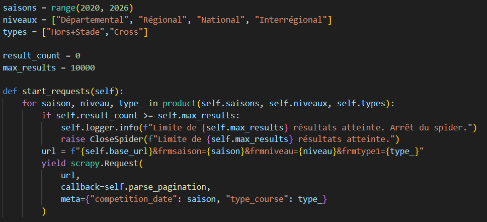


#
# DEVELOPER GUIDE

## Structure du projet
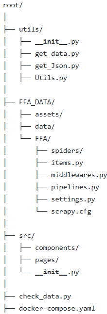


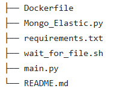

## Architecture du code

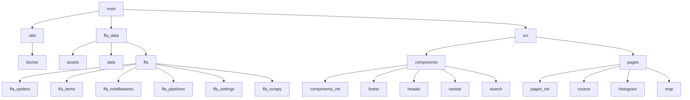


## Introduction

Ce projet est une application web interactive construite avec Dash pour la visualisation et l'analyse des performances de coureurs et des compétitions de marathon. L'application utilise Elasticsearch pour gérer et rechercher des données de compétitions et de coureurs, et MongoDB pour stocker les résultats de course.

L'objectif de l'application est d'offrir une interface simple permettant à l'utilisateur de rechercher des coureurs et des compétitions, de visualiser des cartes géographiques et des graphiques statistiques.

## Description des Fichiers

### main.py

Description : Fichier principal de l'application Dash. Il initialise le serveur Dash et enregistre les pages disponibles. Le layout principal utilise dcc.Location et dash.page_container pour rendre dynamiquement les pages.
Responsabilité : Démarrer l'application Dash et gérer le routage des pages.

### docker-compose.yaml

Description : Fichier de configuration Docker qui définit les services nécessaires à l'application. Il configure MongoDB, Elasticsearch, et l'application elle-même (conteneur app-service).
Responsabilité : Orchestrer les différents services nécessaires au fonctionnement de l'application, y compris la base de données et le serveur web.

### Dockerfile
Description : Ce fichier définit l'environnement de conteneur pour l'application, installant les dépendances et copiant les fichiers nécessaires à l'application.
Responsabilité : Créer un conteneur Docker qui exécutera l'application Dash avec toutes ses dépendances.

### Mongo_Elastic.py
Description : Ce fichier synchronise les données entre MongoDB et Elasticsearch. Il récupère les données de MongoDB, les transforme et les insère dans Elasticsearch.
Responsabilité : Synchroniser les données entre MongoDB et Elasticsearch, gérer l'indexation des documents dans Elasticsearch.

## SRC

### Utils

Les fichiers ici contiennent des fonctions utilitaires pour l'interaction avec les bases de données et la gestion des données.

**get_data.py**

Description : Contient la fonction extract_Http(url) qui télécharge et extrait un fichier ZIP contenant des données CSV. Ces données sont ensuite sauvegardées dans le dossier data/rawdata.
Responsabilité : Télécharger et extraire des fichiers CSV à partir d'une URL fournie.

**get_Json.py**

Description : Contient la fonction extract_GeoJson(url) qui télécharge et charge un fichier GeoJSON à partir d'une URL.
Responsabilité : Télécharger et charger des fichiers GeoJSON pour l'application.

**Utils.py**

Description : Ce fichier contient plusieurs fonctions utilitaires essentielles pour l'application, y compris la gestion des données géographiques et des recherches dans Elasticsearch.
Responsabilité : Gérer les opérations comme le chargement des données géographiques, la recherche dans Elasticsearch, et la génération des cartes.

### Components
Les composants du dashboard se trouvent dans ce dossier. Ils comprennent la barre de navigation, l'en-tête et le pied de page.

**navbar.py**

Description : Définit la barre de navigation du site, permettant à l'utilisateur de naviguer entre les différentes pages.
Responsabilité : Gérer les liens de navigation et l'apparence de la barre de navigation.

**header.py**

Description : Contient le titre principal du site.
Responsabilité : Afficher un titre centré en haut de la page.

**footer.py**

Description : Contient le pied de page avec des informations sur les auteurs et le projet.
Responsabilité : Fournir un pied de page avec des informations sur l'équipe de développement et l'année de création.

### Pages

Les pages du dashboard sont définies ici.

**Coureur.py**

Description : Permet à l'utilisateur de rechercher des coureurs en fonction de différents critères (prénom, nom, club, etc.). Les résultats sont récupérés de Elasticsearch et affichés sous forme de tableau.
Responsabilité : Gérer la recherche des coureurs et afficher les résultats dynamiquement.

**Course.py**

Description : Permet de rechercher des compétitions selon des critères (nom, niveau, département). Les résultats sont affichés sous forme de tableau.
Responsabilité : Gérer la recherche des compétitions et afficher les résultats.

**Map.py**

Description : Affiche une carte des départements français avec des informations sur les coureurs et les compétitions. Utilise la fonction generate_map() pour générer la carte.
Responsabilité : Gérer l'affichage des cartes interactives.

**Histogram.py**

Description : Affiche des histogrammes qui analysent les performances des coureurs en fonction des distances parcourues et des temps de course. Utilise Plotly pour afficher des graphiques dynamiques.
Responsabilité : Gérer l'affichage des histogrammes pour l'analyse des performances.

## Fonctionnalités et Interactions

### Interactivité
L'application utilise des éléments interactifs comme :

dcc.Input et dcc.Dropdown pour les recherches et les filtres dynamiques.
dcc.Graph pour afficher des graphiques et des cartes générées par Plotly.

### Callbacks
Les callbacks sont utilisés pour rendre l'application interactive. Par exemple :

Les résultats de recherche sont mis à jour en fonction des critères de l'utilisateur.
Les graphiques et cartes sont mis à jour dynamiquement en fonction des sélections de l'utilisateur.

### Gestion des données
Les données sont récupérées depuis Elasticsearch et MongoDB, et utilisées pour générer des cartes et des graphiques. Les données de MongoDB sont synchronisées avec Elasticsearch pour permettre une recherche rapide et efficace.


#
# Rapport d'analyse

Dans cette section nous allons vous partager différentes informations sur les pages du dashboard.

## Page d'accueil

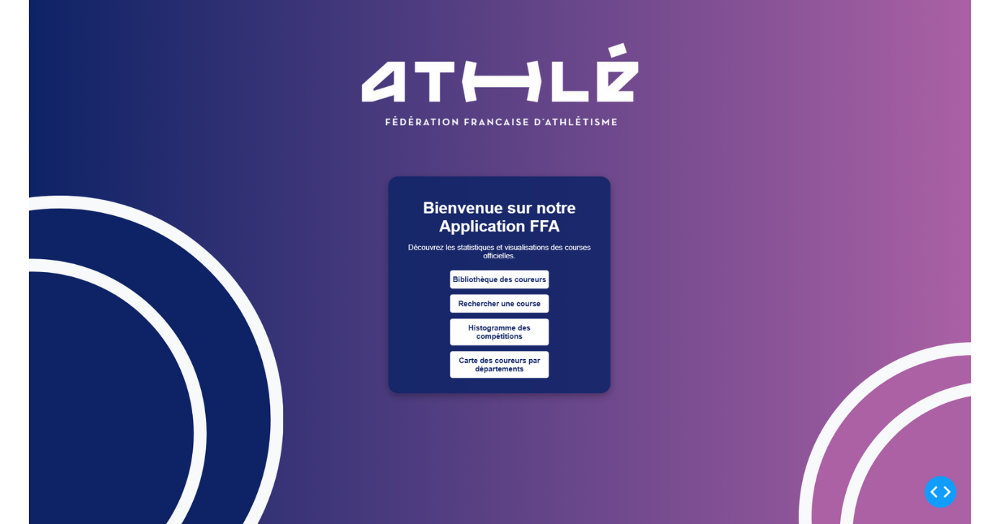

La page d’accueil de notre application a été soigneusement conçue pour offrir une expérience utilisateur fluide, intuitive et visuellement attrayante. Dès l’arrivée sur la plateforme, l’utilisateur est accueilli par une interface moderne et épurée, mettant en avant les différentes fonctionnalités essentielles pour explorer et analyser les performances des coureurs et compétitions. L’ensemble du design de l’application a été créé et importé, garantissant une identité visuelle cohérente et une expérience immersive.

## Page Coureur

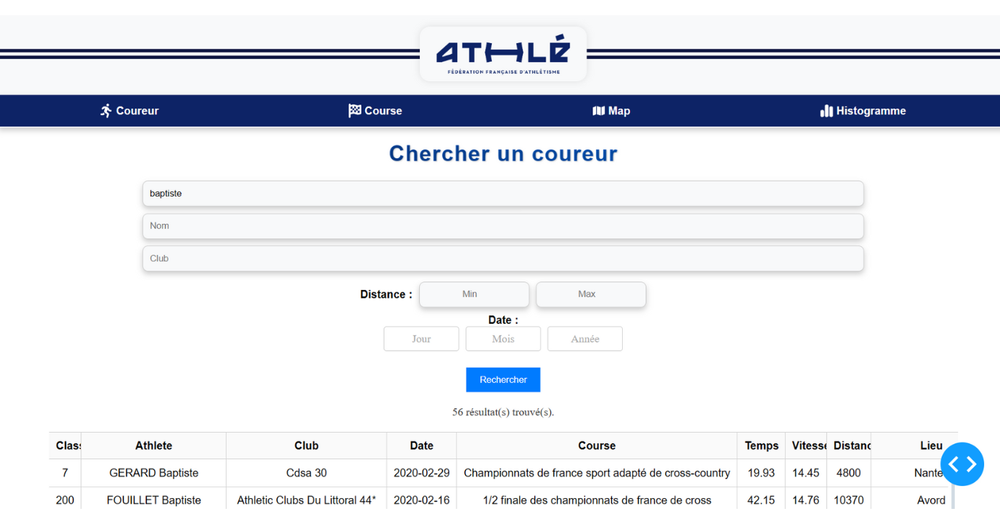

Cette première page vous permet de chercher les résultats d'un coureur à l'aide de ce nom et/ou prenom. Vous pouvez aussi chercher les résultats des coureurs d'un club. De plus, pour ces coureurs, vous pouvez suivre leur résultats sur des plages de distances ou de dates pour une recherche approfondi. Néanmoins voici une petite indication pour utiliser la recherche correctement, lors d'une recherche par date, il est obligatoire d'indiquer une année si un mois est renseigné, de même il est obligatoire d'indiquer un mois si un jour est renseigné.

## Page Course

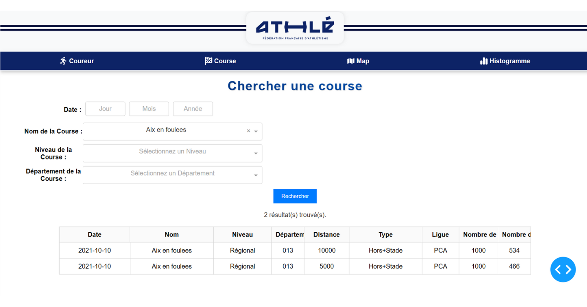

Cette seconde page permet d'étudier cette fois les courses et non pas les coureurs. L'utilisateur peut chercher selon un système de date qui est le même que sur la page précèdente. La recherche peut aussi être précisé selon le nom de la course, le niveau de cette dernière ou bien encore le département où elle a lieu.
 
## Page Map

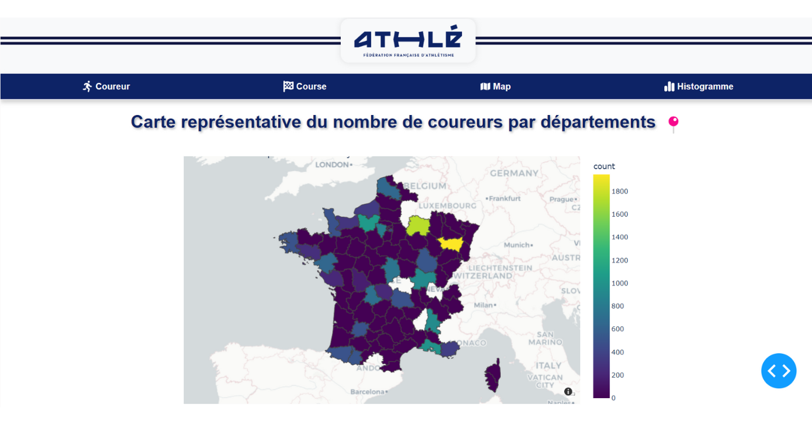

Cette page permet d'avoir une vision d'ensemble de la répartition des coureurs en France selon les départements. On peut ainsi y voir quels sont les départements compétitifs en France pour la course. Les zones non rensignées par une couleur indiquent une absence de donnée pour les évaluer. 

## Page Histogramme

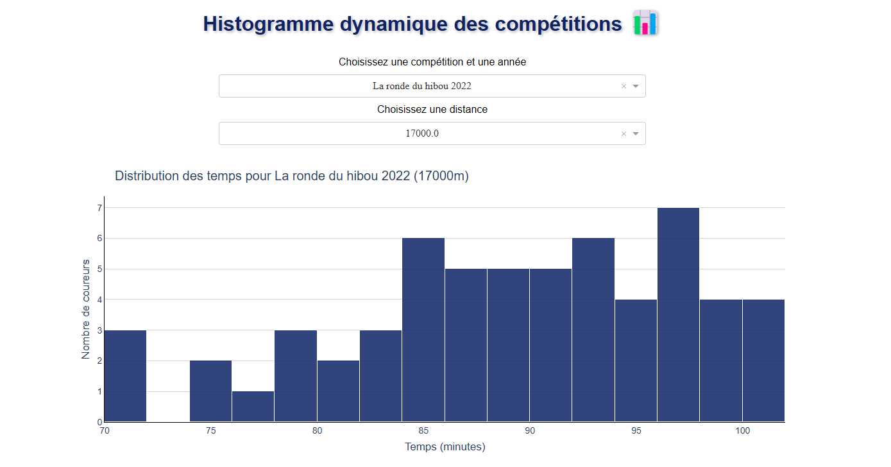

Cette page permet d'observer la distribution des résultats pour la course choisie, ainsi les athlètes peuvent se situer en terme de résultats. On peut bien évidemment choisir la distance de chaque course lors de la recherche.

## Exemple d'utilisation du dashboard

Le but de ce dashboard est de pouvoir trouver ses résultats sur la première page en tant que coureur. Ensuite on peut rechercher la course en question pour l'étudier (nombre de coureur etc). Enfin, grâce à la page histogramme, on peut examiner la distribution des résultats pour se situer dans le niveau de la course. Ainsi chaque coureur peut effectuer une analyse approfondi de ses rsultats sur chaque course qu'il a effectué. 
# DevOps

## **DEVELOPER GUIDE DEVOPS**

### **Structure DevOps**
Ce projet suit une architecture DevOps permettant le déploiement automatisé d'une application web basée sur **Dash**, avec **MongoDB** et **Elasticsearch** comme bases de données. L'ensemble est orchestré via **Kubernetes** sur un cluster AWS EKS.

---

## **Fichiers DevOps**
Le projet contient plusieurs fichiers clés pour l'automatisation du déploiement et la gestion de l'infrastructure :
- **Dockerfile** : Conteneurisation de l'application Dash.
- **docker-compose.yaml** : Configuration pour lancer les services en local.
- **kubernetes/** : Contient les fichiers de configuration pour Kubernetes.
- **.github/workflows/deploy.yml** : Pipeline CI/CD pour l'automatisation du build et du déploiement.
- **src/** : Code source de l'application Dash.
- **data/** : Contient les fichiers CSV de backup et d'importation.
- **Images/** : Contient les images utiles pour la documentation.

---

## **Ouverture des instances AWS**
### **Création et configuration de l'instance**
J'ai choisi une instance **m5.large**, capable de supporter la charge de l'application et les bases de données. Une fois l'instance créée, j'ai attribué une clé `.pem` et me suis connecté via la commande :
```sh
ssh -i Key_FFA.pem ec2-user@<IP_Serveur>
```
Ensuite, j'ai copié mon projet sur le serveur avec :
```sh
scp -i Key_FFA.pem -r Devops_project ec2-user@<IP_Serveur>:/home/ec2-user/
```

### **Configuration du pare-feu et des règles d'accès**
J'ai défini des **Security Groups** pour ouvrir les ports nécessaires :
- **22** : SSH (accès distant)
- **8060** : Accès à l'application Dash
- **80** : HTTP (pour Kubernetes LoadBalancer)

📌 *Configuration des règles de sécurité sur AWS :*
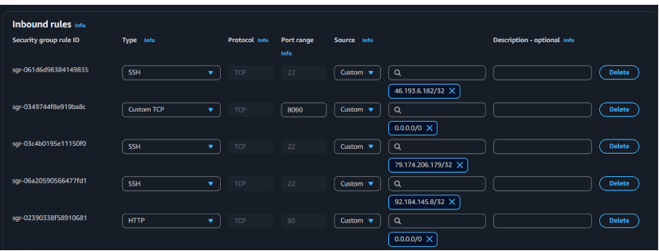

---

## **Gestion des droits dacces**
Les accès sont sécurisés via plusieurs niveaux :
1. **IAM Roles & Policies** :
   - Un utilisateur AWS avec **IAM** a été créé avec des accès restreints à **EC2**, **EKS** et **S3**.
   - Seules les actions essentielles (création de pods, accès aux logs) sont permises.
  
2. **Security Groups** :
   - Seuls certains **IPs autorisés** peuvent accéder à SSH et à l'application via HTTP/HTTPS.
   - Le **port 8060** est exposé uniquement au monde extérieur pour l'application Dash.

3. **Kubernetes RBAC** :
   - L’accès aux pods et services est restreint via des **RoleBindings** sur Kubernetes.
   - Seuls les utilisateurs avec les bons droits peuvent exécuter `kubectl get pods`.

---

## **Lancement de GitHub et Configuration CI/CD**
Le projet est hébergé sur **GitHub**, et un **workflow CI/CD** a été mis en place pour :
1. **Build de l'image Docker**
2. **Push sur DockerHub**
3. **Déploiement automatique sur Kubernetes**

Workflow dans `.github/workflows/deploy.yml` :
```yaml
- name: Build de l'image Docker
  run: docker build -t locquetr123/dash-app:latest .

- name: Push de l'image Docker
  run: docker push locquetr123/dash-app:latest

- name: Déployer MongoDB, Elasticsearch et l'application Dash sur Kubernetes
  run: |
    kubectl apply -f kubernetes/mongodb-deployment.yaml
    kubectl apply -f kubernetes/elasticsearch-deployment.yaml
    kubectl apply -f kubernetes/app-deployment.yaml
```
📌 *Image du pipeline CI/CD en action*

Ces deux images que l'ont peut voir dans le dossier action de github nous montre que le projet marche et nous explique les étapes (docker-compose, Elastic) qui le font tourner

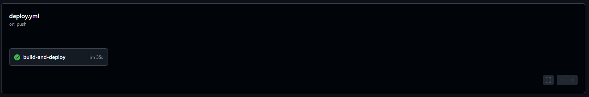

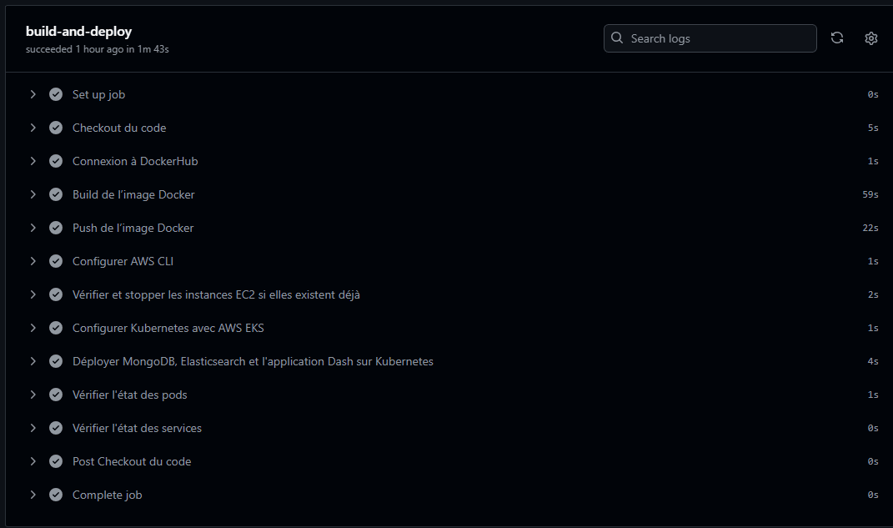

---

## **Installation des packages**
Une fois sur le serveur AWS, j'ai installé les dépendances nécessaires :
```sh
sudo yum update -y
sudo yum install docker -y
sudo systemctl start docker
sudo systemctl enable docker
```
Ensuite, installation de **kubectl**, **eksctl** et **AWS CLI** pour gérer Kubernetes :
```sh
curl -O https://s3.us-west-2.amazonaws.com/amazon-eks/1.27.0/2023-05-05/bin/linux/amd64/kubectl
chmod +x kubectl
sudo mv kubectl /usr/local/bin/
```

---
## Importation des donnees dans Elasticsearch
Les données de performances en marathon ont été importées dans Elasticsearch depuis des fichiers CSV :
```sh
docker exec -i elasticsearch curl -X PUT "http://localhost:9200/athle_results" -H "Content-Type: application/json" -d' {
  "settings": { "number_of_shards": 1, "number_of_replicas": 1 }
}'
```
Puis, chargement des données :
```sh
curl -X POST "http://localhost:9200/athle_results/_bulk" -H "Content-Type: application/json" --data-binary @data/athle_results.json
```

## Creation du Cluster Kubernetes
Le cluster Kubernetes a été déployé sur AWS EKS via la commande :
```sh
eksctl create cluster --name devops-cluster --region us-east-1 --nodegroup-name standard-workers --node-type m5.large --nodes 2
```
Ensuite, les services et pods ont été déployés avec :
```sh
kubectl apply -f kubernetes/
```
📌 *Image des services Kubernetes*

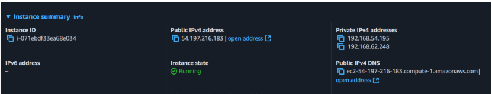
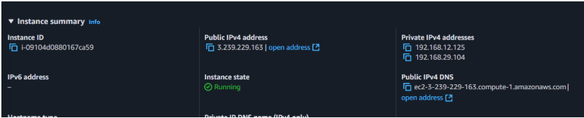

Ici on peut voir les deux IP de mes instances crées via Kubernetes

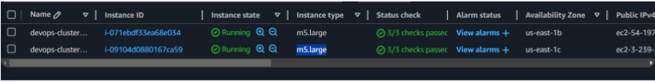

Ici on peut nos deux instances de type large pour subvenir à nos besoins

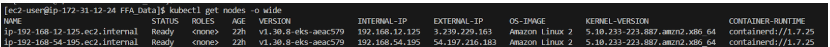

Sur le terminal on peut en tappant la commande *kubectl get nodes -o wide* nos deux nodes equivalentes à des conteneurs kubernetes

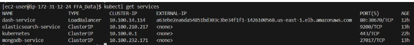

Sur le terminal on peut en tappant la commande *get services*, on obtient les services (images) de notre réseau

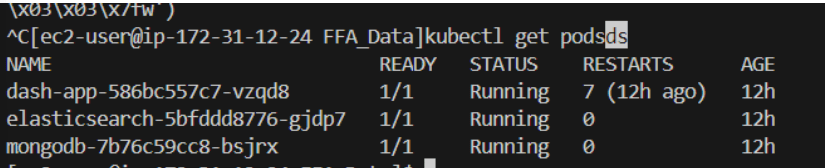

Sur le terminal on peut en tappant la commande *kubectl get podsds*, on obtient toutes les images de notre docker-compose

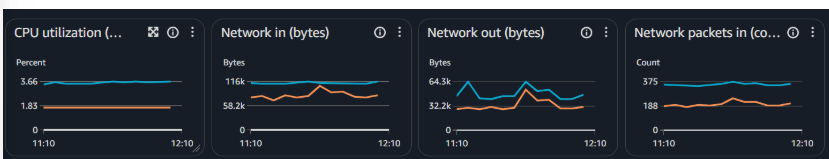

Enfin, sur AWS, on peut analyser nos deux instances, via ce graph

## **Configuration et explication des fichiers Kubernetes**

### **Dash App**
```yaml
apiVersion: apps/v1
kind: Deployment
metadata:
  name: dash-app
spec:
  replicas: 1
  selector:
    matchLabels:
      app: dash
  template:
    metadata:
      labels:
        app: dash
    spec:
      containers:
      - name: dash
        image: locquetr123/dash-app:latest  
        env:
        - name: MONGO_URI
          value: "mongodb://mongodb-service:27017/"
        - name: ELASTICSEARCH_URL
          value: "http://elasticsearch-service:9200"
        ports:
        - containerPort: 8060
---
apiVersion: v1
kind: Service
metadata:
  name: dash-service
spec:
  selector:
    app: dash
  ports:
    - protocol: TCP
      port: 80
      targetPort: 8060
  type: LoadBalancer
```


---

## **Acces a lapplication**
```sh
kubectl get services dash-service
```
Accès :
```
http://<EXTERNAL-IP>:8060
```

---


## Conclusion
Ce projet m'a permis d'automatiser le déploiement d'une application de DataViz avec **Dash**, en utilisant un pipeline CI/CD sur AWS et Kubernetes. J'ai pu ouvrir un serveur, et ainsi crée un premier projet réelement professionelle. J'espère à l'avenir compléter ce projet afin qu'il offre une approche complète de la mise en production et de la gestion de bases de données à grande échelle. Le sujet me passionne, et c'est la première fois que j'ai pu allié ma passion (la course à pied) et un projet de Devops.
Pour plus d'information sur l'application en elle même, veuillez ouvrir la vidéo explicative

---

